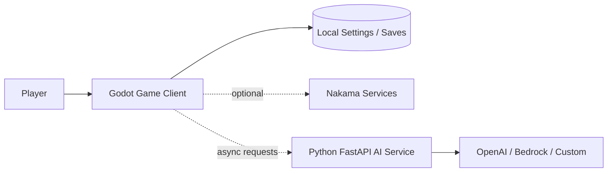
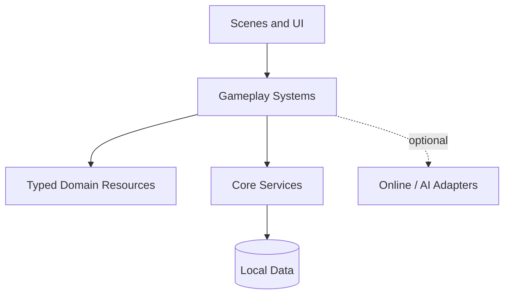

# Architecture Diagrams
## System context

```mermaid
flowchart LR
 Player --> Client[Godot Game Client]
 Client --> Local[(Local Settings / Saves)]
 Client -. optional .-> Nakama[Nakama Services]
 Client -. async requests .-> AI[Python FastAPI AI Service]
 AI --> Providers[OpenAI / Bedrock / Custom]
```
## Client dependency direction

```mermaid
flowchart TD
 Scenes[Scenes and UI] --> Gameplay[Gameplay Systems]
 Gameplay --> Domain[Typed Domain Resources]
 Gameplay --> Core[Core Services]
 Core --> Local[(Local Data)]
 Gameplay -. optional .-> Adapters[Online / AI Adapters]
```
These are target boundaries; Nakama/co-op/AI services are not currently integrated.
